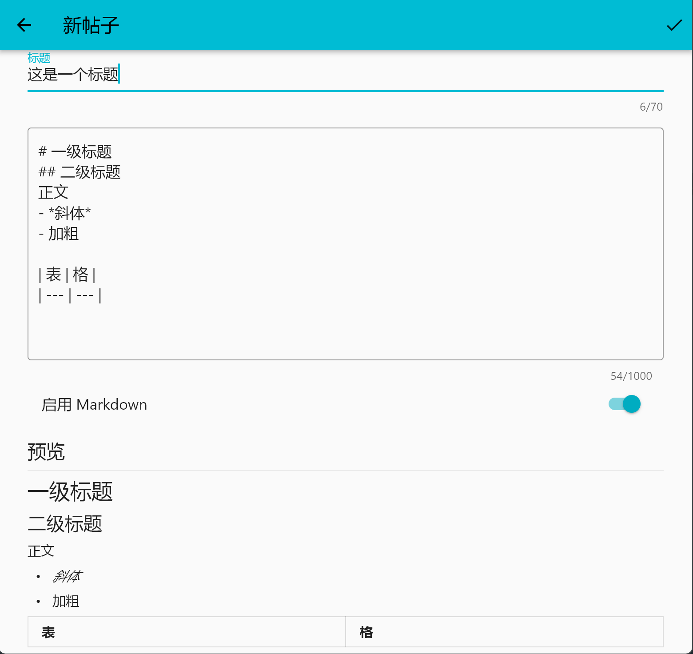
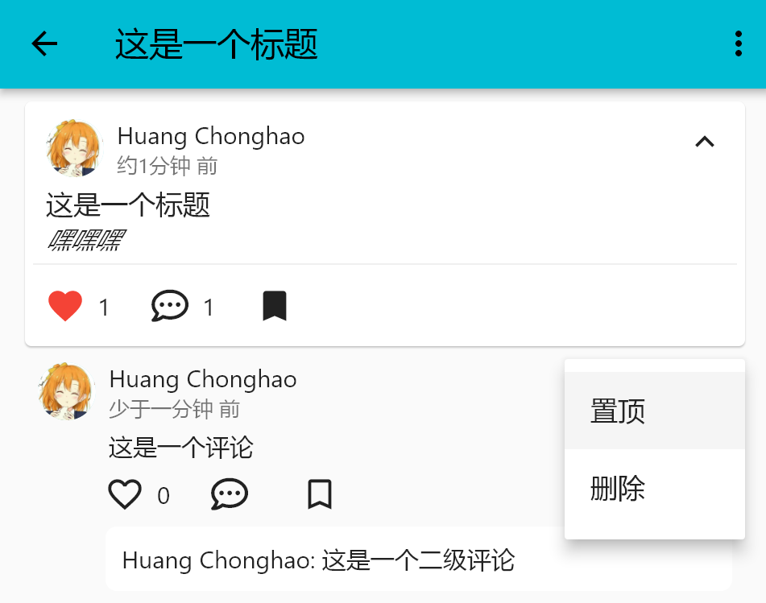
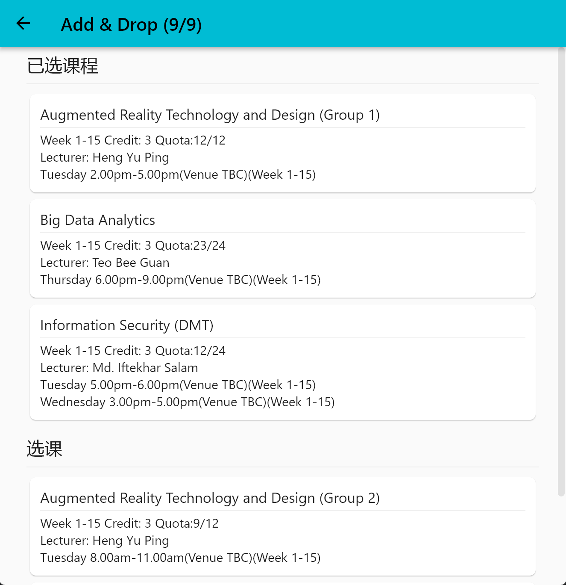
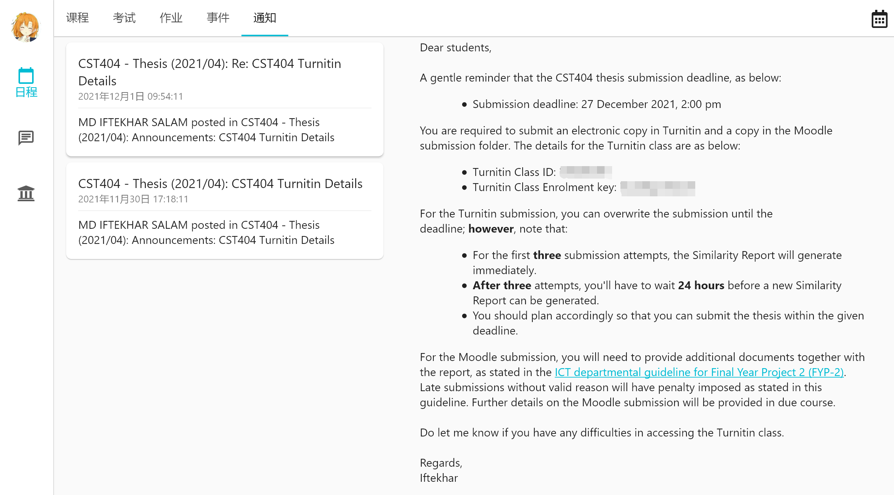
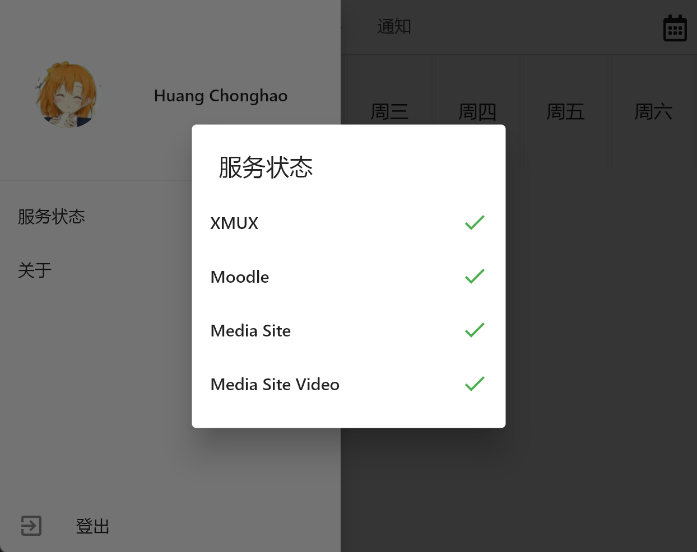

# 3.2.0

## 社区

社区页面现已上线并作为 XMUX 的一级入口，现在它只包含一个发现 Tab，后续我们也计划在此提供包括论坛分区和即时通信在内的其他社区相关功能。

- 新帖子编辑器，可支持 Markdown 格式与实时预览。

  

- 点赞/收藏/置顶

  

- 评论/二级评论/回复评论

  

## 选课

- 新增查看已注册的选修课程。
- 新增课程编辑页，可直接加/减课程。

  

## 核心功能

- 更换了默认头像和头像服务 CDN，加快头像获取速度。
- 双栏布局不再按比例分布，大屏下可以获得更好体验。

  

- 新增“服务状态”对话框，轻松确认各服务连接状态。

  

## 其他

- 修复了 Android 启动页白屏问题。
- 修复了某些情况下可以跳过表单验证的问题。
- 修复了一级页面状态栏沉浸的问题。
- 修复了宽屏幕下 Wolfram 结果未居中的问题。
- 新的“关于”对话框。
